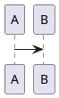

提交规范
* [约定式提交规范 1.0.0](https://www.conventionalcommits.org/zh-hans/v1.0.0/)
* [语义化版本 2.0.0](https://semver.org/lang/zh-CN/)
* [angular 现行规范](https://github.com/angular/angular/blob/master/CONTRIBUTING.md#-commit-message-format)
* 
* [commitizen - git cz 提交工具（默认基于cz-conventional-changelog）](https://github.com/commitizen/cz-cli)

